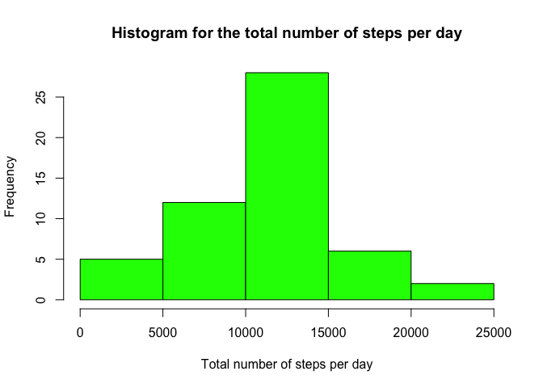
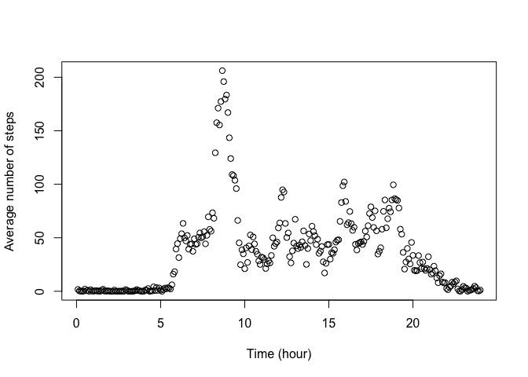
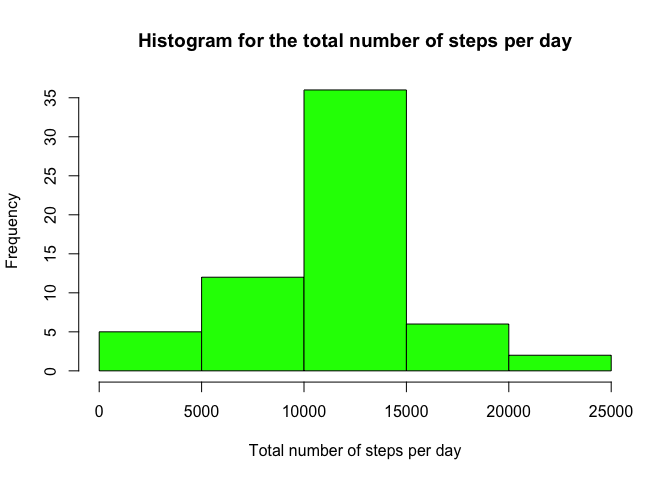
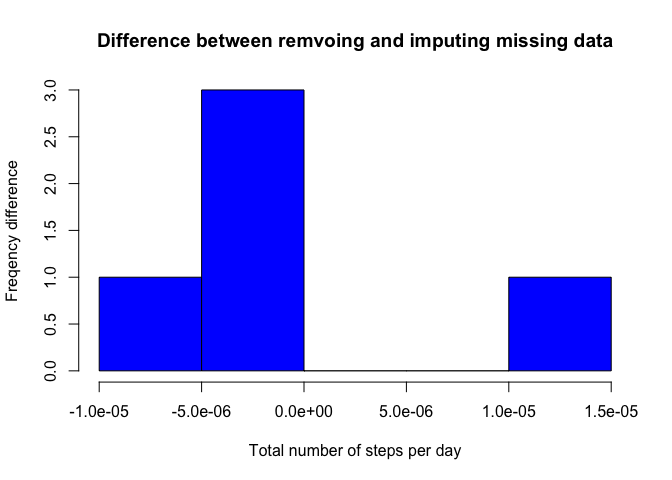
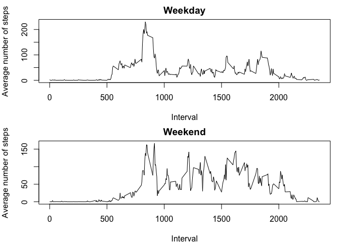

# Reproducible Research: Peer Assessment 1


## Loading and preprocessing the data


```r
activity <- read.csv("./activity.csv")
# Add an additional columne: the numeric form of date
date2 <- as.numeric(activity$date)
activity <- cbind(activity, date2)
```

## What is mean total number of steps taken per day?

### 1. Calculate the total number of steps taken per day

```r
library(data.table)
library(dplyr)
```

```
## 
## Attaching package: 'dplyr'
## 
## The following objects are masked from 'package:data.table':
## 
##     between, last
## 
## The following objects are masked from 'package:stats':
## 
##     filter, lag
## 
## The following objects are masked from 'package:base':
## 
##     intersect, setdiff, setequal, union
```

```r
# remove missing data
activity2 <- subset(activity, activity$steps!="NA")
grp <- group_by(activity2, date2)
ttsteps_perday <- summarise(grp, total=sum(steps))
mean_ttsteps_perday <- mean(ttsteps_perday$total)
mean_ttsteps_perday
```

```
## [1] 10766.19
```

### 2. Make a histogram of the total number of steps taken each day

```r
hist(ttsteps_perday$total, breaks=5, col="green", border="black", 
     main="Histogram for the total number of steps per day", 
     xlab="Total number of steps per day")
```

 

### 3. Calculate and report the mean and median of the total number of steps taken per day

```r
varmean <- mean(ttsteps_perday$total)
varmean2 <- round(varmean,2)
varmedian <- median(ttsteps_perday$total)
```
The mean of the total number of steps taken per day is 1.076619\times 10^{4}.  
The median of the total number of steps taken per day is 10765.

## What is the average daily activity pattern?

### 1. Make a time series plot of the 5-minute interval (x-axis) and the average number of steps taken, averaged across all days (y-axis)


```r
# The number of days is:
ndays <- length(unique(activity$date2))
# The number of steps each day is:
nsteps <- nrow(activity)/ndays
# Convert steps to a matrix:
stepsmatrix <- matrix(activity$steps, nrow=nsteps, ncol=ndays)
# Calculate the average number of steps vs. time for all dates:
mean_nsteps <- rowMeans(stepsmatrix, na.rm=TRUE)
# Plot
time <- (1:nsteps)*5/60   # unit: hour
plot(time, mean_nsteps, xlab="Time (hour)", ylab="Average number of steps")
```

 

### 2. Which 5-minute interval, on average across all the days in the dataset, contains the maximum number of steps?


```r
ns_max <- which(mean_nsteps==max(mean_nsteps), arr.ind=TRUE)
```
The 104th 5-minute interval on average contains the maximum number of steps.

## Imputing missing values

### 1. Calculate and report the total number of missing values in the dataset.


```r
n_na <- nrow(activity[!complete.cases(activity),])
```
The total number of missing values is 2304.

### 2. Devise a strategy for filling in all of the missing values in the dataset. 

We can use the mean of that 5-min interval to fill in the missing values.

### 3. Create a new dataset that is equal to the original dataset but with the missing data filled in.


```r
activity3 <- activity
for (i in 1:nrow(activity3)) {
    if (is.na(activity3$steps[i])==TRUE) {
        ind <- (i-1)%%nsteps+1
        activity3$steps[i]<- mean_nsteps[ind]
        }
}
```

### 4. Make a histogram of the total number of steps taken each day and Calculate and report the mean and median total number of steps taken per day. Do these values differ from the estimates from the first part of the assignment? What is the impact of imputing missing data on the estimates of the total daily number of steps?


```r
# Convert the newly filled data into a matrix
stepsmatrix_new <- matrix(activity3$steps, nrow=nsteps, ncol=ndays)
# Calculate the total number of steps taken each day
ttsteps_perday_new <- colSums(stepsmatrix_new)
hist(ttsteps_perday_new, breaks=5, col="green", border="black", 
     main="Histogram for the total number of steps per day", 
     xlab="Total number of steps per day")
```

 

```r
varmean_new <- round(mean(ttsteps_perday_new),2)
varmedian_new <- median(ttsteps_perday_new)
```
The mean of the total number of steps taken per day is 1.076619\times 10^{4}.  
The median of the total number of steps taken per day is 1.0766189\times 10^{4}.


```r
# Calculate the difference between the previous and the current total daily number of steps.
varprev <- hist(ttsteps_perday$total, breaks=5, freq=FALSE, plot=FALSE)
```

```
## Warning in hist.default(ttsteps_perday$total, breaks = 5, freq = FALSE, :
## argument 'freq' is not made use of
```

```r
varnew <- hist(ttsteps_perday_new, breaks=5, freq=FALSE, plot=FALSE)
```

```
## Warning in hist.default(ttsteps_perday_new, breaks = 5, freq = FALSE, plot
## = FALSE): argument 'freq' is not made use of
```

```r
dff <- varnew$density - varprev$density
hist(dff, breaks=5, col="blue", border="black", 
     main="Difference between remvoing and imputing missing data",
     xlab="Total number of steps per day", ylab="Freqency difference")
```

 
The total values are higher than or equal to the estimates from the first part of the assignment, when comparing them day by day. Taking a look at the difference between the two histograms, the normalized distribution of the current values have only a little diference from the previously calculated estimates.

## Are there differences in activity patterns between weekdays and weekends?

### 1. Create a new factor variable in the dataset with two levels – “weekday” and “weekend” indicating whether a given date is a weekday or weekend day.


```r
dayinweek<- weekdays(as.Date(activity3$date))
weekend_list <- c('Saturday', 'Sunday')
dayinweek2 <- factor((dayinweek %in% weekend_list), levels=c(TRUE,FALSE), labels=c('weekend','weekday'))
activity4 <-cbind(activity3,dayinweek2)
head(activity4)
```

```
##       steps       date interval date2 dayinweek2
## 1 1.7169811 2012-10-01        0     1    weekday
## 2 0.3396226 2012-10-01        5     1    weekday
## 3 0.1320755 2012-10-01       10     1    weekday
## 4 0.1509434 2012-10-01       15     1    weekday
## 5 0.0754717 2012-10-01       20     1    weekday
## 6 2.0943396 2012-10-01       25     1    weekday
```

### 2. Make a panel plot containing a time series plot (i.e. type = "l") of the 5-minute interval (x-axis) and the average number of steps taken, averaged across all weekday days or weekend days (y-axis). 


```r
# Weekdays
weekday_data <- subset(activity4, activity4$dayinweek2=='weekday')
ndays1 <- length(unique(weekday_data$date2))
weekday_matr <- matrix(weekday_data$steps, nrow=nsteps, ncol=ndays1)
mean_nsteps1 <- rowMeans(weekday_matr)
# Weekend
weekend_data <- subset(activity4, activity4$dayinweek2=='weekend')
ndays2 <- length(unique(weekend_data$date2))
weekend_matr <- matrix(weekend_data$steps, nrow=nsteps, ncol=ndays2)
mean_nsteps2 <- rowMeans(weekend_matr)

comb <- cbind(mean_nsteps1, mean_nsteps2, activity4$interval[1:nsteps])
colnames(comb)<-c('weekday','weekend','interval')
# plot
par(mfrow=c(2,1), mar=c(4,4,2,1))
plot(comb[,'interval'], comb[,'weekday'], type='l', xlab="Interval", ylab="Average number of steps", main="Weekday")
plot(comb[,'interval'], comb[,'weekend'], type='l', xlab="Interval", ylab="Average number of steps", main="Weekend")
```

 


